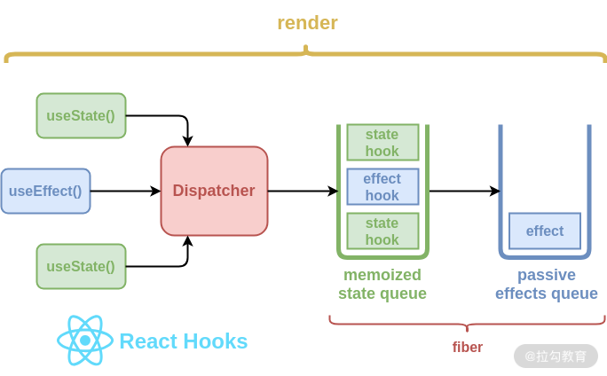

## 设计原理
  
> 所有的 Hooks 都是导入到了 Dispatcher 对象中。在调用 Hook 时，会通过 Dispatcher 调用对应的 Hook 函数。所有的 Hooks 会按顺序存入对应 Fiber 的状态队列中，这样 React 就能知道当前的 Hook 属于哪个 Fiber，即 Hooks 链表。但 Effect Hooks 会有些不同，它涉及了一些额外的处理逻辑。每个 Fiber 的 Hooks 队列中保存了 effect 节点，而每个 effect 的类型都有可能不同，需要在合适的阶段去执行。

通过下面这些资料学习下在react中用ts写自定义hook  

[react-use](https://github.com/streamich/react-use)  

[alibaba/hooks](https://github.com/alibaba/hooks)   

关于Hook讲解的一篇文章看完收获颇丰
  
[无意识设计-复盘React Hook的创造过程](https://github.com/shanggqm/blog/issues/4)  

